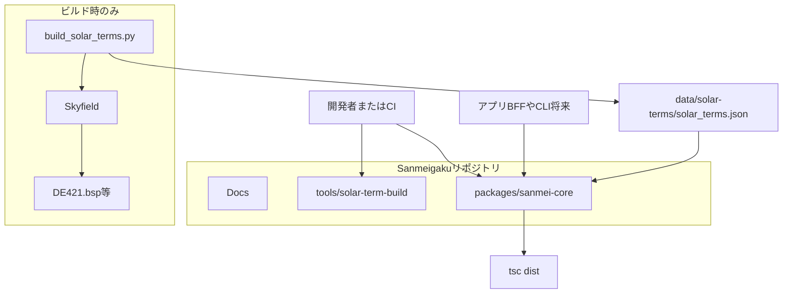
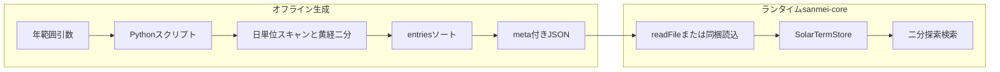
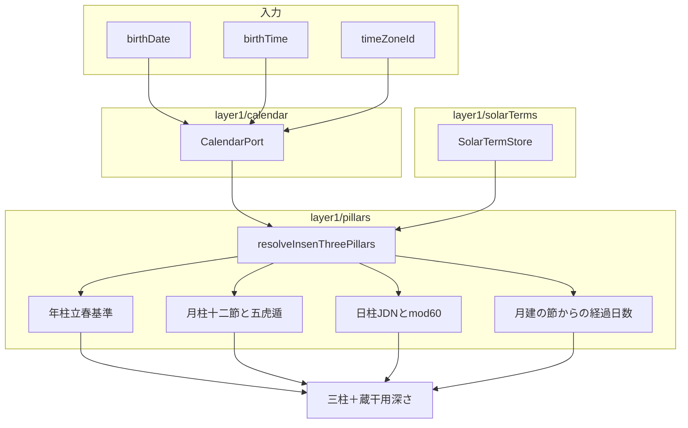
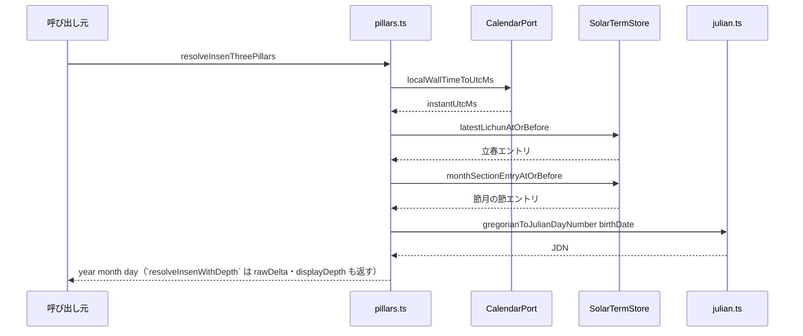
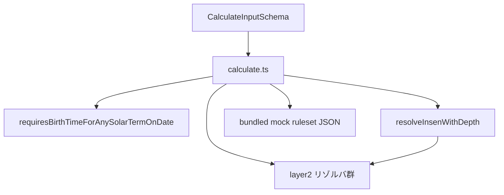
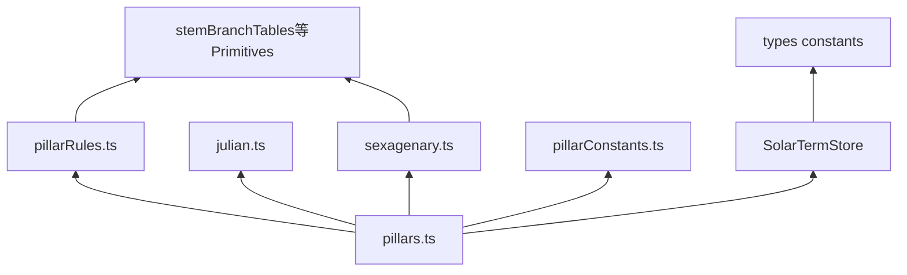
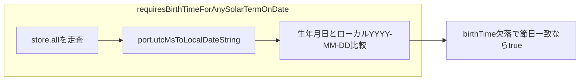

# 実装インデックス（常時更新用）

**リモート Git**: [github.com/DukeGomadango/sanmei-core](https://github.com/DukeGomadango/sanmei-core)（ローカル作業ディレクトリ名と異なってよい）。

本書は **コードベースの現状** を短く追跡するためのドキュメントです。設計の「べき」は [REQUIREMENTS-v1.1.md](./REQUIREMENTS-v1.1.md)・[DOMAIN-GLOSSARY.md](./DOMAIN-GLOSSARY.md) を正とし、実装と乖離したら **本書かコードのどちらかを直し**、可能なら両方を揃えてください。

**メンテ方針**

- PR・リリース前に、変更した節（ディレクトリ・公開 API・データパイプライン）を本書に反映する。
- **層・フェーズ・契約（Proto/Zod 等）や責務境界が変わったら** [ARCHITECTURE-AND-CONTRACTS.md](./ARCHITECTURE-AND-CONTRACTS.md) と、必要なら [DOMAIN-GLOSSARY.md](./DOMAIN-GLOSSARY.md) を更新する。
- **実装で繰り返し使う方針・禁則が変わったら** [.cursor/rules/](../.cursor/rules) を見直す（ルールは長文を持たず正本ドキュメントを指すが、パス・レイヤ説明のズレはここでも解消する）。
- `packages/sanmei-core` の **バージョン**（`meta.engineVersion`・リリースの目安）は [packages/sanmei-core/package.json](../packages/sanmei-core/package.json) の `version` を正とする（本書に毎回書かなくてよい）。
- **レイアウトやサイクルが変わったら**、下記の Mermaid 図も併せて更新する。

---

## システム図（Mermaid）

ビルドや依存の変更後は、図が本文と一致するか確認してください。Cursor / GitHub 等で Mermaid が描画されます。

### リポジトリ全体の配置

開発者・CI・将来の API サーバは **同梱 JSON ＋ `npm` パッケージ** に依存します。天文庫は **ビルド専用**です。



### 節入りマスタのデータフロー



### Layer1：陰占三柱までの計算フロー



### `resolveInsenThreePillars` の呼び出し関係（概略）



### `calculate` オーケストレータ（Layer1→2・概要）



### Layer1 内部の依存（主要ファイル）



### 暦境界と `TIME_REQUIRED`（422 相当の判定片）



---

## 1. リポジトリ構成（実装）

| パス | 役割 |
|------|------|
| [packages/sanmei-core/](../packages/sanmei-core/) | **コアパッケージ**（Layer1＋Layer2 オーケストレータ）。ビルド成果物 `dist/` と同梱データ `data/`。 |
| [tools/solar-term-build/](../tools/solar-term-build/) | 節入り JSON 生成（Python / Skyfield / DE421）。ランタイム非依存。 |
| [README.md](../README.md) | ルートの開発・データ生成コマンド。 |
| [LICENSES.md](../LICENSES.md) | 第三者ライセンス・エフェメリス出所。 |

---

## 2. スコープ（Layer1 の内と外）

**実装済み（Layer1）**

- Primitives: 陰陽・五行・十干・十二支・干合・相生相剋・六十甲子インデックス
- 節入り: 同梱 `solar_terms.json`、メモリ上のソート配列＋二分探索（`SolarTermStore`）
- 暦: `CalendarPort`（初期実装は @js-joda）、民用日時→UTC、ローカル `YYYY-MM-DD` 抽出、節入り日の `TIME_REQUIRED` 判定用ヘルパ
- 陰占三柱: 年柱（立春基準・簡略太陽年ラベル）、月柱（十二「節」＋五虎遁）、日柱（JDN + mod 60）
- **蔵干用の深さ（Layer1）**: `resolveInsenWithDepth` が **月柱と同一の** `monthSectionEntryAtOrBefore` エントリ由来のローカル暦日 JDN と `birthDate` の差から `rawDelta`・`displayDepth` を返す（§5.0）。`resolveInsenThreePillars` はそのラッパ。

**実装済み（Layer2 / Phase L2a＋L2b、mock のみ）**

- Orchestrator: [calculate.ts](../packages/sanmei-core/src/calculate.ts)— `CalculateInputSchema` → `requiresBirthTimeForAnySolarTermOnDate` → `resolveInsenWithDepth` → `rulesetVersion === 'mock-v1'` のバンドル JSON → 蔵干・主星・従星・守護神／忌神・六親（`familyNodes` 座標付き）。`user.timeZoneId` と `context.timeZone` の一致を要求（REQUIREMENTS の民用 TZ 基準）。
- Ruleset: `bundledMockRulesetV1`（`import`）、Zod は `schemas/rulesetMockV1.ts`。欠セルは `RULESET_DATA_MISSING`。
- レスポンス契約: `schemas/layer2.ts`（`baseProfile.insen` に蔵干＋深さ、`yousen`、`familyNodes`；`interactionRules.guardianDeities`／`kishin` は五行コード列＝`Element` 数値）。
- ゴールデン: `src/__fixtures__/golden_mock_v1/`（入力 JSON＋期待 JSON）。

**未実装（Layer2 以降・別フェーズ）**

- 監修 ruleset（`mock-v1` 以外の `rulesetVersion`）、大運・流年の本番 `dynamicTimeline`、位相法・虚気の本実装、`energyData`／`destinyBugs`（L2c）、Proto 正本、HTTP サーバ。

### Layer2 基盤の方針（ドキュメント正本）

#### Phase L2 のスコープ境界（採用）

**Phase L2（L2a＋L2b の到達目標）**で `baseProfile` に載せるブロックは次の **3 つだけ**とする。

| ブロック | 内容 |
|----------|------|
| `insen` | 三柱の器＋**蔵干（初元・中元・本元の採用）** |
| `yousen` | **十大主星**（5 箇所）＋**十二大従星**（3 箇所） |
| `familyNodes` | **六親（座標必須）**。[REQUIREMENTS-v1.1.md](./REQUIREMENTS-v1.1.md) §6.2 は本表に従い座標付きを正とする（[OPEN-QUESTIONS.md](./OPEN-QUESTIONS.md) §11 と整合） |

**Phase L2c（または別 PR）に遅延**: `energyData`（数理法・宇宙盤）、`destinyBugs`（宿命天中殺・異常干支フラグ等）。

守護神・忌神の**計算**は Layer2 の静的ルール内。**レスポンス**では [REQUIREMENTS-v1.1.md](./REQUIREMENTS-v1.1.md) §6.4 に従い **`interactionRules.guardianDeities` / `interactionRules.kishin`** に載せる（Orchestrator の組み立て責務）。

#### Orchestrator・入力・実行順

- **ファイル**: `packages/sanmei-core/src/calculate.ts`。**`CalculateInputSchema`（Zod）**に **`user`（`BirthInput`＋`gender`）**、**`context`（`asOf`・`timeZone` 必須）**、**`systemConfig.sect`／`rulesetVersion`（必須）**を含める（HTTP の `POST /api/v1/calculate` と揃える）。
- **実行順（先頭）**: `requiresBirthTimeForAnySolarTermOnDate`（マスタ全件走査・現仕様維持）→ 未充足なら `SanmeiError` `TIME_REQUIRED_FOR_SOLAR_TERM` → 通過後に Layer1（`resolveInsenWithDepth`）。続けて Layer2。全件走査は Node 上で通常 **ミリ秒未満〜低ミリ秒**クラスでボトルネックになりにくい前提。
- **L2a 暫定**: サポートは **`rulesetVersion === 'mock-v1'` のみ**。それ以外は `RULESET_VERSION_UNSUPPORTED`。BFF は本番と同形のリクエストを送れる。
- **BFF**: HTTP 422 は BFF がマップ。判別用は [§5.0.1](#501-sanmeierror-と機械可読-code)。

#### `mock-v1` ruleset（ファイル・読み込み）

- **配置（リポジトリ・確定）**: `packages/sanmei-core/src/data/rulesets/mock-v1.json`（`tsc` の `rootDir: "src"` と両立）。
- **配布**: `npm run build` は `tsc` のあと `scripts/copy-rulesets.mjs` で **`dist/data/rulesets/*.json` にミラー**し、コンパイル後の相対 `import` が実行時に解決する。
- **ランタイム**: **`fs.readFile` は使わない**。`import` ＋ `with { type: "json" }` による**バンドル取り込み**（`layer2/bundledMockRuleset.ts`）。
- **TypeScript**: `resolveJsonModule: true`。

#### `ruleset` のデータ形（`mock-v1`）

- **Zod**: `schemas/rulesetMockV1.ts` で JSON 全体を検証。
- **キー**: **2 段 `Record`**（例: `"甲": { "子": "STAR_ID", ... }`）。結合キー `"甲-子"` は使わない。
- **欠け**: ルックアップで必須が無い → **`RULESET_DATA_MISSING`**

#### 十大主星（`mock-v1` 専用・エンジン固定）

いずれも **日干 × 対象の干** の行列を 5 回参照。**監修版では規約が変わりうる**。

| 部位（目安） | 対象干（`mock-v1`） | 深さ依存 |
|--------------|---------------------|----------|
| 頭（北） | 年干 | いいえ |
| 胸（中央） | 月支の**採用蔵干** | はい |
| 腹（南） | 日支の**採用蔵干** | はい |
| 右手（西） | 月干 | いいえ |
| 左手（東） | 年支の**採用蔵干** | はい |

十二大従星: **日干 × 年支／月支／日支** の 3 回（干×支表）。

#### その他

- **`ruleset` モック**: 自己整合検証用。メタに監修外である旨を明記。
- **経過日数・蔵干**: §5.0（`rawDelta`／`displayDepth`）、同一深さで年・月・日の支（§5 表）。
- **ゴールデン**: 内部整合。`src/__fixtures__/golden_mock_v1/`。
- **モジュール**: `layer2/*`（`stemBranchKey`・各リゾルバ・`bundledMockRuleset.ts`）、`schemas/layer2.ts`、`schemas/calculateInput.ts`、`schemas/rulesetMockV1.ts`、`errors/sanmeiError.ts`。Proto は §5.1。

#### 実装フェーズ（目安）

- **L2a（済）**: ruleset 取り込み、Zod、従星、守護神／忌神→`interactionRules`、ゴールデン土台、`mock-v1` のみ。
- **L2b（済）**: Layer1 深さ、蔵干、十大主星（上表）、`familyNodes`（座標必須）。※ ruleset は引き続き `mock-v1` のみ。
- **L2c / 別 PR**: `energyData`、`destinyBugs`。

---

## 3. モジュールマップ（`sanmei-core/src`）

依存関係の全体像は冒頭の **システム図**（Mermaid）を参照。

| 領域 | 主なファイル | 内容 |
|------|----------------|------|
| 公開 API | [index.ts](../packages/sanmei-core/src/index.ts) | 再エクスポート集約（`calculate`・`SanmeiError`・Layer2 Zod 型など）。 |
| Orchestrator | [calculate.ts](../packages/sanmei-core/src/calculate.ts)、[schemas/calculateInput.ts](../packages/sanmei-core/src/schemas/calculateInput.ts)、[errors/sanmeiError.ts](../packages/sanmei-core/src/errors/sanmeiError.ts) | §2。TZ 要否→Layer1 深さ→mock ruleset。 |
| Layer2 | [layer2/](../packages/sanmei-core/src/layer2/)、[schemas/layer2.ts](../packages/sanmei-core/src/schemas/layer2.ts)、[schemas/rulesetMockV1.ts](../packages/sanmei-core/src/schemas/rulesetMockV1.ts)、[src/data/rulesets/](../packages/sanmei-core/src/data/rulesets/) | 蔵干・主星・従星・守護神忌神・六親。§2 参照 |
| ゴールデン | [__fixtures__/golden_mock_v1/](../packages/sanmei-core/src/__fixtures__/golden_mock_v1/) | `calculate` 内部整合 |
| Primitives | `layer1/enums.ts`, `stemBranchTables.ts`, `wuxingRelations.ts`, `kango.ts`, `sexagenary.ts` | DOMAIN-GLOSSARY Layer1 に対応。 |
| 定数 | `layer1/pillarConstants.ts` | 年柱アンカー・日柱 JDN 加算（キャリブレーション）。 |
| 柱アルゴリズム | `layer1/pillarRules.ts`, `pillars.ts` | 五虎遁・`resolveInsenThreePillars`。 |
| 節入り | `layer1/solarTerms/*` | `constants`（二十四節 id・月建「節」）, `types`, `store`, `loadJson` |
| 暦 | `layer1/calendar/*` | `julian.ts`, `types`, `jodaAdapter.ts`, `calendarBoundary.ts` |
| 契約（Zod） | `schemas/layer1.ts`、`schemas/layer2.ts`、`schemas/calculateInput.ts`、`schemas/rulesetMockV1.ts` | Layer1 入力片／Layer2 応答／calculate 入力／mock ruleset。 |
| テスト | `*.test.ts` | Vitest。 |

---

## 4. 節入りデータサイクル

1. **生成**: `python tools/solar-term-build/build_solar_terms.py [開始年] [終了年]`
2. **出力**: `packages/sanmei-core/data/solar-terms/solar_terms.json`
3. **メタ**: JSON 内 `meta.ephemerisBundleId`（例: `skyfield-de421-v1`）、`entryCount`、`rangeStartYear` / `rangeEndYear`
4. **ランタイム読込**: `loadBundledSolarTerms()` — パッケージルートからの相対パス（`loadJson.ts` 参照）

### 4.1 `ruleset`（mock）データ

- **配置（ソース）**: `packages/sanmei-core/src/data/rulesets/mock-v1.json`。
- **ビルド後**: `packages/sanmei-core/dist/data/rulesets/mock-v1.json`（`npm run build` 内の `scripts/copy-rulesets.mjs` でコピー）。
- **取り込み**: 節入りと異なり **fs ランタイム読込は使わず** `import` バンドル（`layer2/bundledMockRuleset.ts`）。

**コミット済みマスタの年範囲を変えたら**、本節と必要なら [REQUIREMENTS-v1.1.md](./REQUIREMENTS-v1.1.md) §9 の説明を更新する。

---

## 5. 主要な実装前提（コードと一致させる）

| 項目 | 実装の扱い | 詳細は |
|------|------------|--------|
| 日柱の日界 | 民用暦日 0:00（子初換日なし） | [REQUIREMENTS-v1.1.md](./REQUIREMENTS-v1.1.md) §5 |
| 日柱計算 | `gregorianToJulianDayNumber` + `DAY_PILLAR_JDN_ADDEND`（`pillarConstants.ts`） | キャリブレーション変更時はテスト更新 |
| 太陽年（年柱） | 直近「立春」時刻の **UTC 暦年**でラベル（v1 簡略） | `pillars.ts` の `solarYearLabelUtc` |
| TZ | IANA。初期 `CalendarPort` は js-joda | `jodaAdapter.ts` |
| Layer1 契約 | Zod（Proto は未導入） | `schemas/layer1.ts` |
| Layer1→2 の深さ | **ローカル暦日の JDN 差**（§5.0）。基準節は **月柱と同一の** `monthSectionEntryAtOrBefore` エントリ | 本節・[DOMAIN-GLOSSARY.md](./DOMAIN-GLOSSARY.md) Layer2「蔵干」 |
| 蔵干と深さ | 年・月・日の各支の蔵干は**同一の `displayDepth`**（§5.0）で照合 | `rulesetVersion` で変更しうる |

### 5.0 経過日数（深さ）の定義（採用方針）

**目的**: 蔵干テーブル（「何日目まで初元か」等）と実装の解釈を一意に一致させる。DST や「その日が 23h／25h」といった**経過時間**の揺れは、**カレンダー日の占い**として扱わない。

**定義（sanmei-core v1 採用）**

1. **絶対インスタント同士の経過時間（ミリ秒÷86400 等）では数えない**。
2. **`context.timeZone`（= `BirthInput.timeZoneId`）における民用暦日**どうしの差として数える。実装では既存の `gregorianToJulianDayNumber(year, month, day)`（暦日→JDN）を用いる。
3. **基準となる「節」**は、**月柱計算に使ったエントリと同一**である。すなわち、出生インスタントに対する `SolarTermStore.monthSectionEntryAtOrBefore(instantUtcMs, MONTH_START_TERM_IDS)` の結果 `e` の **`e.instantUtcMs` を同一 TZ でローカル化**した暦日 `(Y_s, M_s, D_s)` の JDN を `JDN_term` とする。`birthDate`（および `birthTime === null` 時の月柱解決と一体である暦日）の JDN を `JDN_birth` とする。
4. **暦日差** `rawDelta = JDN_birth - JDN_term`（非負整数が通常）。
5. **表示深さ（蔵干テーブルと照合する値）** `displayDepth = rawDelta + SOLAR_TERM_DAY_ZERO_INDEXING`。**`SOLAR_TERM_DAY_ZERO_INDEXING` のデフォルトは 1** のため、節入り**当日**（同一ローカル暦日）は `rawDelta = 0`、`displayDepth = 1`。蔵干 JSON の「何日目まで初元か」は **`displayDepth`** と一致させる。オフセットを 0 にする流派対応は定数と JSON を同時に変える。
6. **同一暦日内の節入り前後**は、月柱ロジック（[OPEN-QUESTIONS.md](./OPEN-QUESTIONS.md) 暦・時刻 **1**）により **`e` が「その日の節」ではなく直前の節**になりうる。深さの `JDN_term` は**常にその `e`** 由来のローカル暦日でよい（`birthDate` と同一文字列の節入り日だけを見て基準を取らない）。

**異常系（フェイルファスト）**: `rawDelta < 0` のときは内部不整合またはマスタ欠落の疑いとして **`SanmeiError` `CALCULATION_ANOMALY`**（`details` に理由を格納可）。通常運用では発生させない。

**`birthTime === null`**: 月柱はローカル 0:00 のインスタントで解くため、`JDN_birth` は **`birthDate` の暦日**でよく、月柱・深さで**同じ暦日**を参照する。

**DST**: 暦日ラベルの差として数えるため、**夏時間切替日の「23h／25h」は日数の整数結果には直接現れない**。

### 5.0.1 `SanmeiError` と機械可読 `code`

コアは **`SanmeiError`（`Error` サブクラス）**を導入し、BFF は `instanceof` または `code` で **HTTP／`422`／`400`** にマップする。

| `code` | 用途（例） |
|--------|------------|
| `TIME_REQUIRED_FOR_SOLAR_TERM` | 節入り日一致で `birthTime` 欠落（§7 要件と同一） |
| `RULESET_VERSION_UNSUPPORTED` | 未対応の `rulesetVersion`（L2a は `mock-v1` のみ） |
| `RULESET_DATA_MISSING` | `ruleset` 参照で必須キー欠損 |
| `CALCULATION_ANOMALY` | `rawDelta < 0` 等、想定外の計算結果 |
| `VALIDATION_ERROR` / `INVALID_TIMEZONE` | 入力・TZ（要件 §7 と整合） |

実装時に列挙型（union）で `code` を固定し、未列挙の送出を禁止するとよい。

### 5.1 Zod から Protobuf（SSOT）へ移行するタイミング（採用方針）

Layer2 のスキーマ（`BaseProfile` 等を含むレスポンス塊）について、Zod を唯一の契約とするフェーズのあと、**Protobuf を SSOT とする移行は、次のいずれかが満たされたタイミングで検討・実施する**（AND 必須ではない）。

1. **監修者による `sect` ごとのルール構造・フィールド形が実質確定**したとき（当面は Zod でアジリティを優先）。
2. **第 2 フェーズの Rust マイクロサービス等、Proto が有利な言語境界**が具体化したとき。

詳細は [ARCHITECTURE-AND-CONTRACTS.md](./ARCHITECTURE-AND-CONTRACTS.md) §2 を正とする。

---

## 6. コマンド

```bash
# ルート
npm install
npm test          # workspace 経由で sanmei-core の Vitest

# パッケージ単体
cd packages/sanmei-core && npm run build && npm run test
```

---

## 7. ドキュメント・ルール更新チェックリスト

### 7.1 運用（毎 PR・エージェントのタスク完了時）

**目的**: CI がドキュメントを検証しないため、**コードと `Docs/`・`.cursor/rules` のズレをマージ前に止血**する。

1. **§7.2 を上から目視**し、今回の変更に**該当する項目**について、同じ PR（同一セッション）で正本を更新する。該当なしの項目は PR 本文で「§7.2: 該当なし（例: §4 は節入りを触っていない）」と書いてよい。
2. **`.github/pull_request_template.md`** のドキュメント欄を埋める（人間向け PR）。エージェントはタスク完了報告に、**触った §7.2 項目**を短く列挙する。
3. **「ドキュメントは後で」禁止**。次セッションに回すと索引・ルールの誤誘導が再発する（プロジェクトルールの原則）。

### 7.2 項目一覧（該当するものを満たす）

- [ ] 新規エントリポイント・ファイルを §3 に追加した（該当時）
- [ ] **システム図**（Mermaid）を依存・フロー変更に合わせた（該当時）
- [ ] 節入りの年範囲・生成手順を §4 と突き合わせた（`tools/` または `data/solar-terms` を変えたとき）
- [ ] 公開するアルゴリズム前提（§5）をコード・要件の両方で矛盾なくした（該当時）
- [ ] **契約・用語・境界**が変わったら [DOMAIN-GLOSSARY.md](./DOMAIN-GLOSSARY.md) / [OPEN-QUESTIONS.md](./OPEN-QUESTIONS.md) / [REQUIREMENTS-v1.1.md](./REQUIREMENTS-v1.1.md) の該当箇所を更新した（該当時）
- [ ] **アーキテクチャ・Proto／契約・フェーズ**を変えたら [ARCHITECTURE-AND-CONTRACTS.md](./ARCHITECTURE-AND-CONTRACTS.md) を更新した（該当時）
- [ ] **Layer2 系**（`ruleset` 配置・Zod・ゴールデン・深さ・`SanmeiError` 等）を §2・§5 とコードで揃えた（該当時。変更がなければスキップ可）
- [ ] [Docs/README.md](./README.md) の索引から本書が辿れる（索引やパスを変えたとき）

### 7.3 節目（マイルストーン）— 全件レビュー＋ルールの短文化

以下のような**節目**を含む PR では、§7.2 の**すべて**について「要更新／該当なし／既に最新」を確認し、PR で明示する。また **`.cursor/rules/sanmei-project.mdc`（リポジトリ骨格）**と **`sanmei-architecture.mdc`（層・パス禁則）**が正本ドキュメントと矛盾していれば、**同じ PR または直続 PR**で直す（長文は Docs 側、ルールにはパス・禁則のみ）。

| 節目の例 |
|----------|
| 新 Layer・サブパッケージ・`calculate` 公開契約の変更 |
| 節入りマスタの生成手順・同梱パス・年範囲の変更 |
| SSOT を Proto／OpenAPI に切り替える等、契約方式の変更 |
| 監修 `ruleset` の本番取り込み（`mock-v1` 以外の版を正式サポートし始める） |
| エージェントが同じ前提ミスを繰り返す（再発防止をルールに 1〜3 行追加） |

---

## 8. 関連ドキュメント

| 文書 | 役割 |
|------|------|
| [ARCHITECTURE-AND-CONTRACTS.md](./ARCHITECTURE-AND-CONTRACTS.md) | Monorepo・Proto 方針・ゴールデン・**コア／BFF 責務（§2.4）** |
| [OPEN-QUESTIONS.md](./OPEN-QUESTIONS.md) | 暦・学派ごとの確定論点 |
| [DOMAIN-GLOSSARY.md](./DOMAIN-GLOSSARY.md) | Layer1/2/3 の概念境界 |
