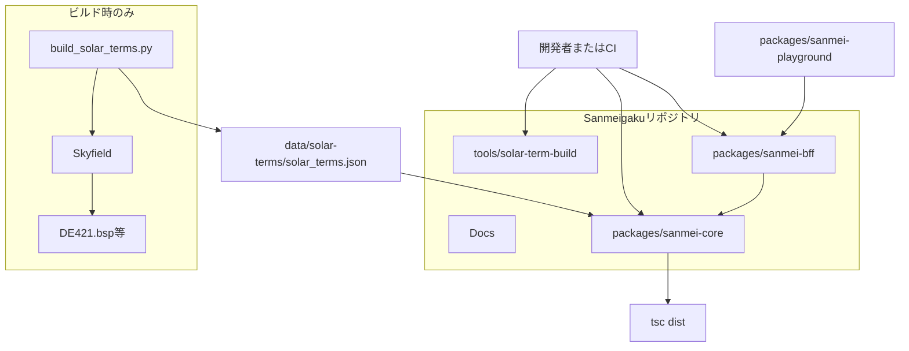
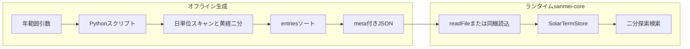
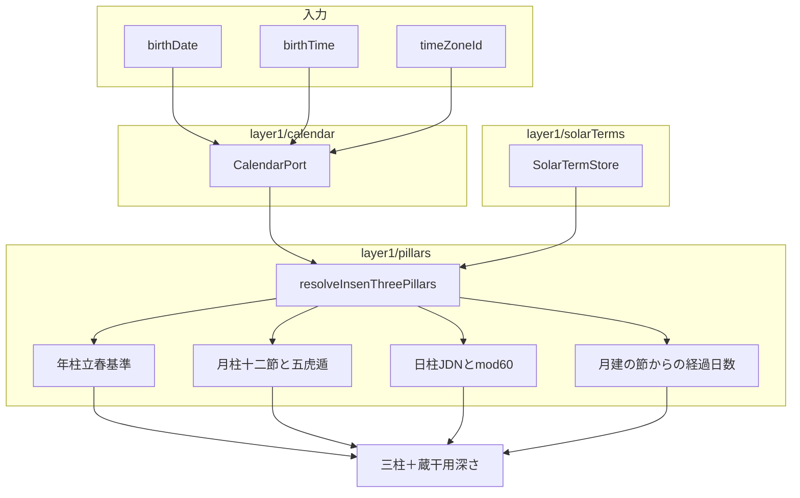
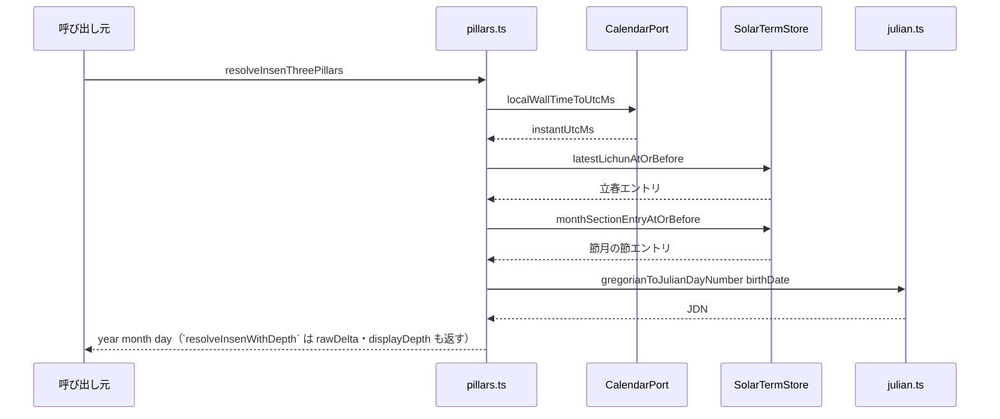
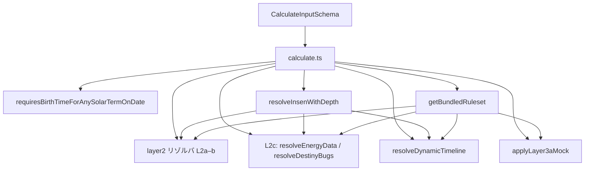
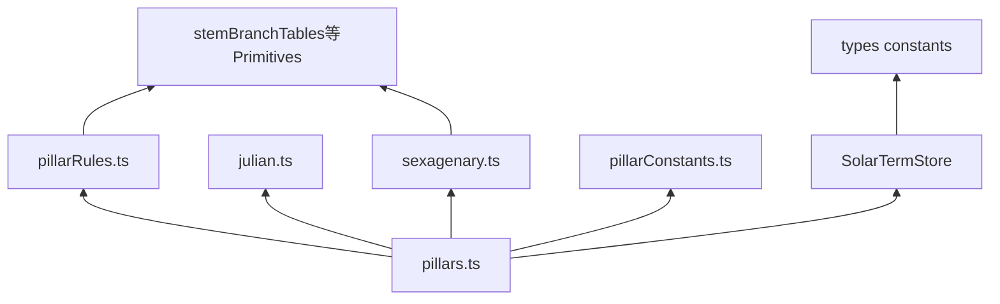
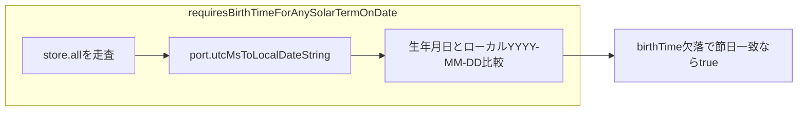

# 実装インデックス（常時更新用）

**リモート Git**: [github.com/DukeGomadango/sanmei-core](https://github.com/DukeGomadango/sanmei-core)（ローカル作業ディレクトリ名と異なってよい）。

本書は **コードベースの現状** を短く追跡するためのドキュメントです。設計の「べき」は [REQUIREMENTS-v1.1.md](./REQUIREMENTS-v1.1.md)・[DOMAIN-GLOSSARY.md](./DOMAIN-GLOSSARY.md) を正とし、実装と乖離したら **本書かコードのどちらかを直し**、可能なら両方を揃えてください。

**メンテ方針**

- PR・リリース前に、変更した節（ディレクトリ・公開 API・データパイプライン）を本書に反映する。
- **層・フェーズ・契約（Proto/Zod 等）や責務境界が変わったら** [ARCHITECTURE-AND-CONTRACTS.md](./ARCHITECTURE-AND-CONTRACTS.md) と、必要なら [DOMAIN-GLOSSARY.md](./DOMAIN-GLOSSARY.md) を更新する。
- **実装で繰り返し使う方針・禁則が変わったら** [.cursor/rules/](../.cursor/rules) を見直す（ルールは長文を持たず正本ドキュメントを指すが、パス・レイヤ説明のズレはここでも解消する）。
- `packages/sanmei-core` の **バージョン**（`meta.engineVersion`・リリースの目安）は [packages/sanmei-core/package.json](../packages/sanmei-core/package.json) の `version` を正とする（本書に毎回書かなくてよい）。
- **レイアウトやサイクルが変わったら**、下記の Mermaid 図も併せて更新する。

---

## システム図（Mermaid）

ビルドや依存の変更後は、図が本文と一致するか確認してください。Cursor / GitHub 等で Mermaid が描画されます。

### リポジトリ全体の配置

開発者・CI・将来の API サーバは **同梱 JSON ＋ `npm` パッケージ** に依存します。天文庫は **ビルド専用**です。



### 節入りマスタのデータフロー



### Layer1：陰占三柱までの計算フロー



### `resolveInsenThreePillars` の呼び出し関係（概略）



### `calculate` オーケストレータ（Layer1→2・概要）



### Layer1 内部の依存（主要ファイル）



### 暦境界と `TIME_REQUIRED`（422 相当の判定片）



---

## 1. リポジトリ構成（実装）

| パス | 役割 |
|------|------|
| [packages/sanmei-core/](../packages/sanmei-core/) | **コアパッケージ**（Layer1＋Layer2 オーケストレータ）。ビルド成果物 `dist/` と同梱データ `data/`。 |
| [tools/solar-term-build/](../tools/solar-term-build/) | 節入り JSON 生成（Python / Skyfield / DE421）。ランタイム非依存。 |
| [README.md](../README.md) | ルートの開発・データ生成コマンド。 |
| [LICENSES.md](../LICENSES.md) | 第三者ライセンス・エフェメリス出所。 |
| [.github/workflows/ci.yml](../.github/workflows/ci.yml) | **CI**: `npm ci` → `npm test` → `npm run build`（Node 20）。 |

---

## 2. スコープ（Layer1 の内と外）

**実装済み（Layer1）**

- Primitives: 陰陽・五行・十干・十二支・干合・相生相剋・六十甲子インデックス
- 節入り: 同梱 `solar_terms.json`、メモリ上のソート配列＋二分探索（`SolarTermStore`）
- 暦: `CalendarPort`（初期実装は @js-joda）、民用日時→UTC、ローカル `YYYY-MM-DD` 抽出、節入り日の `TIME_REQUIRED` 判定用ヘルパ
- 陰占三柱: 年柱（立春基準・簡略太陽年ラベル）、月柱（十二「節」＋五虎遁）、日柱（JDN + mod 60）
- **蔵干用の深さ（Layer1）**: `resolveInsenWithDepth` が **月柱と同一の** `monthSectionEntryAtOrBefore` エントリ由来のローカル暦日 JDN と `birthDate` の差から `rawDelta`・`displayDepth` を返す（§5.0）。`resolveInsenThreePillars` はそのラッパ。

**実装済み（Layer2 / Phase L2a＋L2b＋L2c、mock のみ）**

- Orchestrator: [calculate.ts](../packages/sanmei-core/src/calculate.ts)— `CalculateInputSchema` → `requiresBirthTimeForAnySolarTermOnDate` → `resolveInsenWithDepth` → **`getBundledRuleset(rulesetVersion)`**（`mock-v1` / `mock-internal-v2`）→ 蔵干・主星・従星・守護神／忌神・六親（`familyNodes` 座標付き）→ **L2c** `resolveEnergyData`／`resolveDestinyBugs` → **`dynamicTimeline`**（`.resolveDynamicTimeline`、mock・満年齢ベースの `currentPhase`）→ **Layer3a スタブ** `applyLayer3aMock`（`isouhou` 空・`kyoki: null`）。`user.timeZoneId` と `context.timeZone` の一致を要求（REQUIREMENTS の民用 TZ 基準）。
- Ruleset: [bundledRulesets.ts](../packages/sanmei-core/src/layer2/bundledRulesets.ts)＋`bundledMockRulesetV1`（後方互換）、Zod は `schemas/rulesetMockV1.ts`（`BundledRulesetSchema`＝`mock-v1`／`mock-internal-v2` の `z.union`、`timelineMock`、`meta.schemaRevision`、`energyWeights` 等）。欠セルは `RULESET_DATA_MISSING`。
- レスポンス契約: `schemas/layer2.ts`（`baseProfile` は従来どおり＋**`dynamicTimeline`**（`daiun`／`annual` 等）。**`interactionRules`** に `isouhou`・`kyoki`（スタブは `[]`／`null`）を追加；`guardianDeities`／`kishin` は五行コード列＝`Element` 数値）。
- ゴールデン: `src/__fixtures__/golden_mock_v1/`（入力 JSON＋期待 JSON）。**追加手順（要約）**: 入力 JSON を追加 → `calculate` を固定 `nowUtcMs` で実行 → `CalculateResultSchema.safeParse` 通過を確認 → 期待値は `meta.calculatedAt`／必要なら `engineVersion` を [goldenHarness](../packages/sanmei-core/src/__tests__/goldenHarness.ts) で正規化してコミット。

**未実装（別フェーズ）**

- 監修 ruleset（学派別本番データ）、`dynamicTimeline` の学派依存境界の本算法、位相法・虚気・格法の**本実装**（Layer3；現状はスタブのみ）、Proto 正本、HTTP サーバ。

### Layer2 基盤の方針（ドキュメント正本）

#### Phase L2 のスコープ境界（採用）

**Phase L2a＋L2b＋L2c（到達済・mock）**で `baseProfile` に載せるブロックは次の **5 つ**。

| ブロック | 内容 |
|----------|------|
| `insen` | 三柱の器＋**蔵干（初元・中元・本元の採用）** |
| `yousen` | **十大主星**（5 箇所）＋**十二大従星**（3 箇所） |
| `familyNodes` | **六親（座標必須）**。[REQUIREMENTS-v1.1.md](./REQUIREMENTS-v1.1.md) §6.2 は本表に従い座標付きを正とする（[OPEN-QUESTIONS.md](./OPEN-QUESTIONS.md) §11 と整合） |
| `energyData` | **数理法・行動領域（L2c）**。入力は**位相法・虚気を加味しない**素の三柱＋蔵干（採用蔵干まで）のみ。幾何は **極座標（度×10 整数）**と**面積比（千分率整数）**。算法は `mock-v1` の `energyWeights`／`energyMock`（詳細は同節「Phase L2c」）。 |
| `destinyBugs` | **出生時点で一生不変**の宿命系フラグ（L2c）。`destinyBugRules` 照合。**年運・大運天中殺・スライド**は [REQUIREMENTS-v1.1.md](./REQUIREMENTS-v1.1.md) `dynamicTimeline.tenchuSatsuStatus` 側（[DOMAIN-GLOSSARY.md](./DOMAIN-GLOSSARY.md) §3.2）。 |

守護神・忌神の**計算**は Layer2 の静的ルール内。**レスポンス**では [REQUIREMENTS-v1.1.md](./REQUIREMENTS-v1.1.md) §6.4 に従い **`interactionRules.guardianDeities` / `interactionRules.kishin`** に載せる（Orchestrator の組み立て。現状は L2a/b 直後に組み立て、`calculate` パイプライン上は **位相法より前**）。

#### Phase L2c（`energyData`／`destinyBugs`）— 採用方針

**入力スコープ（L2c）**

- **含める**: Layer1／L2a/b が返す**素の命式**—三柱・深さに基づく蔵干（初／中／本の干および採用スロット）、既存ルールで確定した陽占ブロックがあれば参照可。
- **含めない（L2c）**: **位相法**（半会・三合・干合など）による干／五行の**仮想的な置き換え**、**虚気**による `shadowYousen` 相当の状態。これらを加味した数理・エネルギーは **Layer3（将来）** の責務（例: `shadowEnergyData` 等の別フィールドで検討。正本は GLOSSARY）。
- **意図**: L2c 実装は **位相法・虚気の完成を待たず**に進められる。

**`energyData`（出力契約の骨子）**

- **Zod で厳格に固定**する（浮動小数のまま生返ししない）。
- **幾何**: **各頂点の極座標（角度）**を **度×10 の整数**（`vertexAnglesDegTenths`）および**行動領域の面積比**を **千分率の整数**（`areaRatioPermille`）に集約。一般の二次メッシュ座標は L2c の契約外（将来拡張は別フィールド・別 `rulesetVersion` で検討）。
- **mock の頂点角度（実装計画に準拠）**: 宇宙盤の円周 360° を六十甲子 60 ステップに対応させる慣習（**1 ステップ 6°**）に合わせ、**年・月・日柱の六十甲子インデックス（0〜59）ごとに** `vertexAnglesDegTenths = index * 60` とする（UI 描画テストが本番近似に寄る）。
- **面積比の算出**: 角度→単位円上の直交座標 `(cos θ, sin θ)` に変換し、**Shoelace 公式（靴ひもの公式）**で多角形面積を求める。辺長＋**ヘロンの公式**は `sqrt` 連鎖で誤差が増えやすいため L2c では用いない。最大面積（単位円に内接する正三角形の面積など）で除算して permille に**整数化**する。**オーバー時は 1000 クランプ**を検討。
- **丸めとゴールデン**: 中間計算は浮動小数になりうるが、**レスポンスは整数のみ**。学派ごとに丸めが変わる場合は **後から `ruleset` メタ**へ移せるが、mock 段階ではエンジン固定でよい。
- **算法の中身**（干支の重み行列など）は **`ruleset` に閉じる**（[DOMAIN-GLOSSARY.md](./DOMAIN-GLOSSARY.md) §2.3）。

**`destinyBugs`（静的タクソノミの骨子）**

- **格納するのは**出生情報から決まり**生涯変わらない**フラグのみ（宿命天中殺・異常干支等）。**年運／大運天中殺・スライド・`asOf` 依存**は一切ここに載せない。
- **表現**: 安定 **`code` 文字列**の列（または `code` ＋補助フィールドを持つオブジェクト列）。学派差の真理値表は **`ruleset` JSON**（mock は本章 §4.1 の単一 `mock-v1.json` を拡張）。
- **重複コード**: リゾルバでは気にせず付与し、**Zod の `.transform` でユニーク配列に正規化**してもよい（オーケストレータを汚さない。順序は初出順など仕様で固定）。
- **コード例**（監修確定前のプレースホルダ。名称は OPEN-QUESTIONS 参照）: `SHUKUMEI_TENCHUSATSU_YEAR`、`SHUKUMEI_TENCHUSATSU_MONTH`、`IJOU_KANSHI_NORMAL`、`IJOU_KANSHI_DARK`（**暗干支**を指す。**暗号**との誤記に注意）。

**mock `rulesetVersion: mock-v1` の拡張**

- **別 JSON ファイルに分けない**。既存 [src/data/rulesets/mock-v1.json](../packages/sanmei-core/src/data/rulesets/mock-v1.json) にブロックを追加し、**単一のエンジン検証ベクトル**を保つ。
- **追加ブロック例**: `energyWeights`（干など→重み。将来は支・蔵干重みも `ruleset` で拡張可）、`destinyBugRules`（異常干支リスト・宿命天中殺参照表など）。**Zod**（`schemas/rulesetMockV1.ts`）を同期拡張。
- **追跡**: JSON `meta` に **`schemaRevision`**（整数インクリメント）または同等を載せ、**同一文字列 `mock-v1` でも中身の世代**が分かるようにする（リリースノートまたは IMPLEMENTATION と突き合わせ）。

#### Orchestrator 実行順（正本・将来の Layer3 含む）

**現状**（Layer2a/b＋L2c まで）: Layer1（暦・三柱＋深さ）→ L2a/b リゾルバ → 守護神／忌神を `interactionRules` に載せる → **L2c**（`energyData`／`destinyBugs`、位相・虚気は見ない）。

**目標 DAG（L2c〜Layer3 本番）**— 依存の向きのみ規定（レスポンス JSON のキー順は任意）:

1. **Layer1**: 暦・三柱＋`displayDepth`
2. **Layer2a/b**: 蔵干・主星・従星・六親；**守護神／忌神**（静的）を `interactionRules` に載せる
3. **Layer2c**: **`energyData`・`destinyBugs`**（位相・虚気は**見ない**）
4. **Layer3a**: **位相法**（`interactionRules.isouhou`）・**虚気**（`kyoki`／`shadowYousen`）
5. **Layer3b（格法）**: [SECT-RULESET-MATRIX.template.md](./SECT-RULESET-MATRIX.template.md) と `allowGohouInKaku` に従い、**Layer2 の素の命式**と **Layer3a の結果**を入力に**格・局**を最終判定

これにより L2c は **Layer3a をブロックしない**。

#### Orchestrator・入力・実行順

- **ファイル**: `packages/sanmei-core/src/calculate.ts`。**`CalculateInputSchema`（Zod）**に **`user`（`BirthInput`＋`gender`）**、**`context`（`asOf`・`timeZone` 必須）**、**`systemConfig.sect`／`rulesetVersion`（必須）**を含める（HTTP の `POST /api/v1/calculate` と揃える）。
- **実行順（先頭）**: `requiresBirthTimeForAnySolarTermOnDate`（マスタ全件走査・現仕様維持）→ 未充足なら `SanmeiError` `TIME_REQUIRED_FOR_SOLAR_TERM` → 通過後に Layer1（`resolveInsenWithDepth`）。続けて Layer2。全件走査は Node 上で通常 **ミリ秒未満〜低ミリ秒**クラスでボトルネックになりにくい前提。
- **バンドル ruleset**: サポートは **`BUNDLED_RULESET_VERSIONS`**（例: `mock-v1`、`mock-internal-v2`）。レジストリに無い版は `RULESET_VERSION_UNSUPPORTED`。BFF は本番と同形のリクエストを送れる。
- **BFF**: [REQUIREMENTS-v1.1.md](./REQUIREMENTS-v1.1.md) §7 に従い `SanmeiError`・`MALFORMED_JSON` を **400 / 422 / 500** にマップ。判別用は [§5.0.1](#501-sanmeierror-と機械可読-code)。

#### `mock-v1` ruleset（ファイル・読み込み）

- **配置（リポジトリ・確定）**: `packages/sanmei-core/src/data/rulesets/mock-v1.json`（`tsc` の `rootDir: "src"` と両立）。
- **配布**: `npm run build` は `tsc` のあと `scripts/copy-rulesets.mjs` で **`dist/data/rulesets/*.json` にミラー**し、コンパイル後の相対 `import` が実行時に解決する。
- **ランタイム**: **`fs.readFile` は使わない**。`import` ＋ `with { type: "json" }` による**バンドル取り込み**（`layer2/bundledMockRuleset.ts`）。
- **TypeScript**: `resolveJsonModule: true`。

#### `ruleset` のデータ形（`mock-v1`）

- **Zod**: `schemas/rulesetMockV1.ts` で JSON 全体を検証。
- **キー**: **2 段 `Record`**（例: `"甲": { "子": "STAR_ID", ... }`）。結合キー `"甲-子"` は使わない。
- **欠け**: ルックアップで必須が無い → **`RULESET_DATA_MISSING`**

#### 十大主星（`mock-v1` 専用・エンジン固定）

いずれも **日干 × 対象の干** の行列を 5 回参照。**監修版では規約が変わりうる**。

| 部位（目安） | 対象干（`mock-v1`） | 深さ依存 |
|--------------|---------------------|----------|
| 頭（北） | 年干 | いいえ |
| 胸（中央） | 月支の**採用蔵干** | はい |
| 腹（南） | 日支の**採用蔵干** | はい |
| 右手（西） | 月干 | いいえ |
| 左手（東） | 年支の**採用蔵干** | はい |

十二大従星: **日干 × 年支／月支／日支** の 3 回（干×支表）。

#### その他

- **`ruleset` モック**: 自己整合検証用。メタに監修外である旨を明記。
- **経過日数・蔵干**: §5.0（`rawDelta`／`displayDepth`）、同一深さで年・月・日の支（§5 表）。
- **ゴールデン**: 内部整合。`src/__fixtures__/golden_mock_v1/`。
- **モジュール**: `layer2/*`（`stemBranchKey`・各リゾルバ・**`l2cGeometry.ts`**・**`resolveEnergyData.ts`**・**`resolveDestinyBugs.ts`**・`bundledMockRuleset.ts`）、`schemas/layer2.ts`、`schemas/calculateInput.ts`、`schemas/rulesetMockV1.ts`、`errors/sanmeiError.ts`。Proto は §5.1。

#### 実装フェーズ（目安）

- **L2a（済）**: ruleset 取り込み、Zod、従星、守護神／忌神→`interactionRules`、ゴールデン土台、`mock-v1` のみ。
- **L2b（済）**: Layer1 深さ、蔵干、十大主星（上表）、`familyNodes`（座標必須）。※ ruleset は引き続き `mock-v1` のみ。
- **L2c（済・mock）**: `energyData`・`destinyBugs`。`mock-v1` の `schemaRevision` は **2**（`timelineMock` 追加時にインクリメント）。
- **DynamicTimeline（済・mock）**: `resolveDynamicTimeline`・`timelineMock`（満年齢による `currentPhase`／`annual` のプレースホルダ）。要件の細部は [REQUIREMENTS-v1.1.md](./REQUIREMENTS-v1.1.md) §6.3。
- **Layer3a（スタブ済）**: `applyLayer3aMock`（`isouhou`・`kyoki` の枠のみ）。
- **フェーズ2（計画・未完了）**: 本番 `takao-v1` バンドル・大運本算法・監修ゴールデン。**手順・前提の正本は [PHASE2-RULESET-AND-DAIUN.md](./PHASE2-RULESET-AND-DAIUN.md)**（フロント開発は BFF 契約＋ mock で並行可）。

---

## 3. モジュールマップ（リポジトリ）

依存関係の全体像は冒頭の **システム図**（Mermaid）を参照。

**監修データとスナップショット**: `@sanmei/sanmei-bff` の `toMatchFileSnapshot` は **内部回帰（mock 応答）専用**。監修確定の正解は **明示 JSON** のみ更新する（手書きまたは承認済み PR）。将来 `fixtures/supervised/` 等に置いてもよい。`-u` で監修値を機械更新しない運用とする。

| 領域 | 主なファイル | 内容 |
|------|----------------|------|
| HTTP BFF | [packages/sanmei-bff/](../packages/sanmei-bff/)（[app.ts](../packages/sanmei-bff/src/app.ts)、[mapSanmeiErrorToHttp.ts](../packages/sanmei-bff/src/mapSanmeiErrorToHttp.ts)、[server.ts](../packages/sanmei-bff/src/server.ts)） | **Hono**。`POST /api/v1/calculate`・`GET /` 最小 Playground。[REQUIREMENTS-v1.1.md](./REQUIREMENTS-v1.1.md) §7 で `SanmeiError`・`MALFORMED_JSON` を HTTP 化。Vitest は [src/__tests__/](../packages/sanmei-bff/src/__tests__/)（成功応答は `toMatchFileSnapshot`＋`meta` 正規化）。 |
| Playground SPA | [packages/sanmei-playground/](../packages/sanmei-playground/) | 管理者用の Vite+React+TS SPA。SaaSレベルの Bento ダッシュボードで `POST /api/v1/calculate` の結果を可視化し、`error.code`/`details` を表示する（モバイルは `ControlPanel` を Accordion 折りたたみ）。React Query の `queryKey` 依存同期を含む。**UI運用メモ**: カード内余白は原則 `p-5`、タイトル下余白は `mb-4` を基準に揃える。タイムライン文言は `whitespace-nowrap` で単語途中改行を防ぐ。 |
| 公開 API | [index.ts](../packages/sanmei-core/src/index.ts) | 再エクスポート集約（`calculate`・`SanmeiError`・Layer2 Zod 型など）。 |
| Orchestrator | [calculate.ts](../packages/sanmei-core/src/calculate.ts)、[schemas/calculateInput.ts](../packages/sanmei-core/src/schemas/calculateInput.ts)、[errors/sanmeiError.ts](../packages/sanmei-core/src/errors/sanmeiError.ts) | §2。TZ 要否→Layer1 深さ→mock ruleset。 |
| Layer2 | [layer2/](../packages/sanmei-core/src/layer2/)、[schemas/layer2.ts](../packages/sanmei-core/src/schemas/layer2.ts)、[schemas/rulesetMockV1.ts](../packages/sanmei-core/src/schemas/rulesetMockV1.ts)、[src/data/rulesets/](../packages/sanmei-core/src/data/rulesets/) | 蔵干・主星・従星・守護神忌神・六親・**L2c**・**`resolveDynamicTimeline`**・**`applyLayer3aMock`**・[bundledRulesets.ts](../packages/sanmei-core/src/layer2/bundledRulesets.ts)。§2 参照 |
| ゴールデン | [__fixtures__/golden_mock_v1/](../packages/sanmei-core/src/__fixtures__/golden_mock_v1/)、[__tests__/goldenHarness.ts](../packages/sanmei-core/src/__tests__/goldenHarness.ts) | `calculate` 内部整合・メタ正規化ヘルパ |
| Primitives | `layer1/enums.ts`, `stemBranchTables.ts`, `wuxingRelations.ts`, `kango.ts`, `sexagenary.ts` | DOMAIN-GLOSSARY Layer1 に対応。 |
| 定数 | `layer1/pillarConstants.ts` | 年柱アンカー・日柱 JDN 加算（キャリブレーション）。 |
| 柱アルゴリズム | `layer1/pillarRules.ts`, `pillars.ts` | 五虎遁・`resolveInsenThreePillars`。 |
| 節入り | `layer1/solarTerms/*` | `constants`（二十四節 id・月建「節」）, `types`, `store`, `loadJson` |
| 暦 | `layer1/calendar/*` | `julian.ts`, `types`, `jodaAdapter.ts`, `calendarBoundary.ts` |
| 契約（Zod） | `schemas/layer1.ts`、`schemas/layer2.ts`、`schemas/calculateInput.ts`、`schemas/rulesetMockV1.ts` | Layer1 入力片／Layer2 応答／calculate 入力／mock ruleset。 |
| テスト | `*.test.ts`、`__tests__/goldenHarness.ts` | Vitest。ルート `npm test` は **全 workspace** の `test` を実行。 |

---

## 4. 節入りデータサイクル

1. **生成**: `python tools/solar-term-build/build_solar_terms.py [開始年] [終了年]`
2. **出力**: `packages/sanmei-core/data/solar-terms/solar_terms.json`
3. **メタ**: JSON 内 `meta.ephemerisBundleId`（例: `skyfield-de421-v1`）、`entryCount`、`rangeStartYear` / `rangeEndYear`
4. **ランタイム読込**: `loadBundledSolarTerms()` — パッケージルートからの相対パス（`loadJson.ts` 参照）

### 4.1 `ruleset`（mock）データ

- **配置（ソース）**: `packages/sanmei-core/src/data/rulesets/*.json`（`mock-v1.json`、`mock-internal-v2.json`＝レジストリ検証用・本文は mock と同形）。
- **ビルド後**: `packages/sanmei-core/dist/data/rulesets/*.json`（`npm run build` 内の [copy-rulesets.mjs](../packages/sanmei-core/scripts/copy-rulesets.mjs) が `src/data/rulesets` の **全 `.json`** をミラー）。
- **取り込み**: 節入りと異なり **fs ランタイム読込は使わず** `import` バンドル（[bundledRulesets.ts](../packages/sanmei-core/src/layer2/bundledRulesets.ts)、後方互換 [bundledMockRuleset.ts](../packages/sanmei-core/src/layer2/bundledMockRuleset.ts)）。
- **Zod**: `BundledRulesetSchema`＝`z.union`（将来 **discriminatedUnion** 布石）。`mock-v1` の **`meta.schemaRevision`** は **2**（`timelineMock` 追加）。
- **L2c**: `energyWeights`・`energyMock`・`destinyBugRules` を同一 JSON に載せる。**中身を変えたら** `schemaRevision` を上げ、**ゴールデン**と Zod を同期する。
- **`timelineMock`**: 大運 mock（`fixedStartAge`・`phaseSpanYears`・`firstPhaseSexagenaryIndex` 等）。厳密な節入り境界は監修版で拡張。

**コミット済みマスタの年範囲を変えたら**、本節と必要なら [REQUIREMENTS-v1.1.md](./REQUIREMENTS-v1.1.md) §9 の説明を更新する。

---

## 5. 主要な実装前提（コードと一致させる）

| 項目 | 実装の扱い | 詳細は |
|------|------------|--------|
| 日柱の日界 | 民用暦日 0:00（子初換日なし） | [REQUIREMENTS-v1.1.md](./REQUIREMENTS-v1.1.md) §5 |
| 日柱計算 | `gregorianToJulianDayNumber` + `DAY_PILLAR_JDN_ADDEND`（`pillarConstants.ts`） | キャリブレーション変更時はテスト更新 |
| 太陽年（年柱） | 直近「立春」時刻の **UTC 暦年**でラベル（v1 簡略） | `pillars.ts` の `solarYearLabelUtc` |
| TZ | IANA。初期 `CalendarPort` は js-joda | `jodaAdapter.ts` |
| Layer1 契約 | Zod（Proto は未導入） | `schemas/layer1.ts` |
| Layer1→2 の深さ | **ローカル暦日の JDN 差**（§5.0）。基準節は **月柱と同一の** `monthSectionEntryAtOrBefore` エントリ | 本節・[DOMAIN-GLOSSARY.md](./DOMAIN-GLOSSARY.md) Layer2「蔵干」 |
| 蔵干と深さ | 年・月・日の各支の蔵干は**同一の `displayDepth`**（§5.0）で照合 | `rulesetVersion` で変更しうる |

### 5.0 経過日数（深さ）の定義（採用方針）

**目的**: 蔵干テーブル（「何日目まで初元か」等）と実装の解釈を一意に一致させる。DST や「その日が 23h／25h」といった**経過時間**の揺れは、**カレンダー日の占い**として扱わない。

**定義（sanmei-core v1 採用）**

1. **絶対インスタント同士の経過時間（ミリ秒÷86400 等）では数えない**。
2. **`context.timeZone`（= `BirthInput.timeZoneId`）における民用暦日**どうしの差として数える。実装では既存の `gregorianToJulianDayNumber(year, month, day)`（暦日→JDN）を用いる。
3. **基準となる「節」**は、**月柱計算に使ったエントリと同一**である。すなわち、出生インスタントに対する `SolarTermStore.monthSectionEntryAtOrBefore(instantUtcMs, MONTH_START_TERM_IDS)` の結果 `e` の **`e.instantUtcMs` を同一 TZ でローカル化**した暦日 `(Y_s, M_s, D_s)` の JDN を `JDN_term` とする。`birthDate`（および `birthTime === null` 時の月柱解決と一体である暦日）の JDN を `JDN_birth` とする。
4. **暦日差** `rawDelta = JDN_birth - JDN_term`（非負整数が通常）。
5. **表示深さ（蔵干テーブルと照合する値）** `displayDepth = rawDelta + SOLAR_TERM_DAY_ZERO_INDEXING`。**`SOLAR_TERM_DAY_ZERO_INDEXING` のデフォルトは 1** のため、節入り**当日**（同一ローカル暦日）は `rawDelta = 0`、`displayDepth = 1`。蔵干 JSON の「何日目まで初元か」は **`displayDepth`** と一致させる。オフセットを 0 にする流派対応は定数と JSON を同時に変える。
6. **同一暦日内の節入り前後**は、月柱ロジック（[OPEN-QUESTIONS.md](./OPEN-QUESTIONS.md) 暦・時刻 **1**）により **`e` が「その日の節」ではなく直前の節**になりうる。深さの `JDN_term` は**常にその `e`** 由来のローカル暦日でよい（`birthDate` と同一文字列の節入り日だけを見て基準を取らない）。

**異常系（フェイルファスト）**: `rawDelta < 0` のときは内部不整合またはマスタ欠落の疑いとして **`SanmeiError` `CALCULATION_ANOMALY`**（`details` に理由を格納可）。通常運用では発生させない。

**`birthTime === null`**: 月柱はローカル 0:00 のインスタントで解くため、`JDN_birth` は **`birthDate` の暦日**でよく、月柱・深さで**同じ暦日**を参照する。

**DST**: 暦日ラベルの差として数えるため、**夏時間切替日の「23h／25h」は日数の整数結果には直接現れない**。

### 5.0.1 `SanmeiError` と機械可読 `code`

コアは **`SanmeiError`（`Error` サブクラス）**を導入し、BFF は `instanceof` または `code` で **HTTP** にマップする（詳細は [REQUIREMENTS-v1.1.md](./REQUIREMENTS-v1.1.md) §7）。

| `code` | 用途（例） | BFF が返す HTTP（正本は要件 §7） |
|--------|------------|-----------------------------------|
| `VALIDATION_ERROR` | `CalculateInput` 検証失敗など | 400 |
| `INVALID_TIMEZONE` | TZ・暦変換の解釈失敗 | 400 |
| `RULESET_VERSION_UNSUPPORTED` | 未バンドルの `rulesetVersion` | 422 |
| `TIME_REQUIRED_FOR_SOLAR_TERM` | 節入り日一致で `birthTime` 欠落 | 422 |
| `RULESET_DATA_MISSING` | `ruleset` 参照で必須キー欠損（配備不整合） | 500（レスポンス `details` はマスク） |
| `CALCULATION_ANOMALY` | `rawDelta < 0` 等 | 500（`details` マスク） |

**BFF 専用**（コア前段）: ボディが JSON として解釈できない → **400**・`MALFORMED_JSON`（要件 §7）。

実装時に列挙型（union）で `code` を固定し、未列挙の送出を禁止するとよい。

### 5.1 Zod から Protobuf（SSOT）へ移行するタイミング（採用方針）

Layer2 のスキーマ（`BaseProfile` 等を含むレスポンス塊）について、Zod を唯一の契約とするフェーズのあと、**Protobuf を SSOT とする移行は、次のいずれかが満たされたタイミングで検討・実施する**（AND 必須ではない）。

1. **監修者による `sect` ごとのルール構造・フィールド形が実質確定**したとき（当面は Zod でアジリティを優先）。
2. **第 2 フェーズの Rust マイクロサービス等、Proto が有利な言語境界**が具体化したとき。

詳細は [ARCHITECTURE-AND-CONTRACTS.md](./ARCHITECTURE-AND-CONTRACTS.md) §2 を正とする。

---

## 6. コマンド

```bash
# ルート
npm install
npm test          # sanmei-core をビルド → core の test → sanmei-bff の test（[package.json](../package.json) の順序固定）
npm run build     # sanmei-core → sanmei-bff の順（BFF はコアの dist に依存）

# パッケージ単体
cd packages/sanmei-core && npm run build && npm run test
cd packages/sanmei-bff && npm run build && npm test   # 事前にコア build 必須
npm run dev -w @sanmei/sanmei-playground              # Playground 開発サーバ
npm run build -w @sanmei/sanmei-playground            # Playground ビルド確認
```

---

## 7. ドキュメント・ルール更新チェックリスト

### 7.1 運用（毎 PR・エージェントのタスク完了時）

**目的**: CI がドキュメントを検証しないため、**コードと `Docs/`・`.cursor/rules` のズレをマージ前に止血**する。

1. **§7.2 を上から目視**し、今回の変更に**該当する項目**について、同じ PR（同一セッション）で正本を更新する。該当なしの項目は PR 本文で「§7.2: 該当なし（例: §4 は節入りを触っていない）」と書いてよい。
2. **`.github/pull_request_template.md`** のドキュメント欄を埋める（人間向け PR）。エージェントはタスク完了報告に、**触った §7.2 項目**を短く列挙する。
3. **「ドキュメントは後で」禁止**。次セッションに回すと索引・ルールの誤誘導が再発する（プロジェクトルールの原則）。

### 7.2 項目一覧（該当するものを満たす）

- [ ] 新規エントリポイント・ファイルを §3 に追加した（該当時）
- [ ] **システム図**（Mermaid）を依存・フロー変更に合わせた（該当時）
- [ ] 節入りの年範囲・生成手順を §4 と突き合わせた（`tools/` または `data/solar-terms` を変えたとき）
- [ ] 公開するアルゴリズム前提（§5）をコード・要件の両方で矛盾なくした（該当時）
- [ ] **契約・用語・境界**が変わったら [DOMAIN-GLOSSARY.md](./DOMAIN-GLOSSARY.md) / [OPEN-QUESTIONS.md](./OPEN-QUESTIONS.md) / [REQUIREMENTS-v1.1.md](./REQUIREMENTS-v1.1.md) の該当箇所を更新した（該当時）
- [ ] **アーキテクチャ・Proto／契約・フェーズ**を変えたら [ARCHITECTURE-AND-CONTRACTS.md](./ARCHITECTURE-AND-CONTRACTS.md) を更新した（該当時）
- [ ] **Layer2 系**（`ruleset` 配置・Zod・ゴールデン・深さ・`SanmeiError` 等）を §2・§5 とコードで揃えた（該当時。変更がなければスキップ可）
- [ ] **L2c**（`energyData`／`destinyBugs`・mock の `schemaRevision`・`rulesetMockV1`）を触ったら §2「Phase L2c」・§4.1・REQUIREMENTS §6.2・OPEN-QUESTIONS「L2c」と一致させた（該当時）
- [ ] [Docs/README.md](./README.md) の索引から本書が辿れる（索引やパスを変えたとき）

### 7.3 節目（マイルストーン）— 全件レビュー＋ルールの短文化

以下のような**節目**を含む PR では、§7.2 の**すべて**について「要更新／該当なし／既に最新」を確認し、PR で明示する。また **`.cursor/rules/sanmei-project.mdc`（リポジトリ骨格）**と **`sanmei-architecture.mdc`（層・パス禁則）**が正本ドキュメントと矛盾していれば、**同じ PR または直続 PR**で直す（長文は Docs 側、ルールにはパス・禁則のみ）。

| 節目の例 |
|----------|
| **L2c 初実装**（`energyData`／`destinyBugs`・mock `schemaRevision`・Zod 拡張） |
| 新 Layer・サブパッケージ・`calculate` 公開契約の変更 |
| 節入りマスタの生成手順・同梱パス・年範囲の変更 |
| SSOT を Proto／OpenAPI に切り替える等、契約方式の変更 |
| 監修 `ruleset` の本番取り込み（`mock-v1` 以外の版を正式サポートし始める） |
| エージェントが同じ前提ミスを繰り返す（再発防止をルールに 1〜3 行追加） |

---

## 8. 関連ドキュメント

| 文書 | 役割 |
|------|------|
| [ARCHITECTURE-AND-CONTRACTS.md](./ARCHITECTURE-AND-CONTRACTS.md) | Monorepo・Proto 方針・ゴールデン・**コア／BFF 責務（§2.4）** |
| [OPEN-QUESTIONS.md](./OPEN-QUESTIONS.md) | 暦・学派ごとの確定論点 |
| [DOMAIN-GLOSSARY.md](./DOMAIN-GLOSSARY.md) | Layer1/2/3 の概念境界 |
