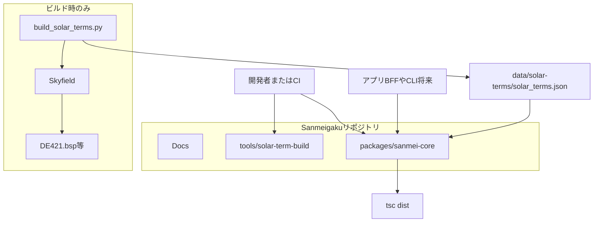
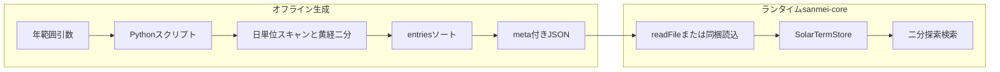
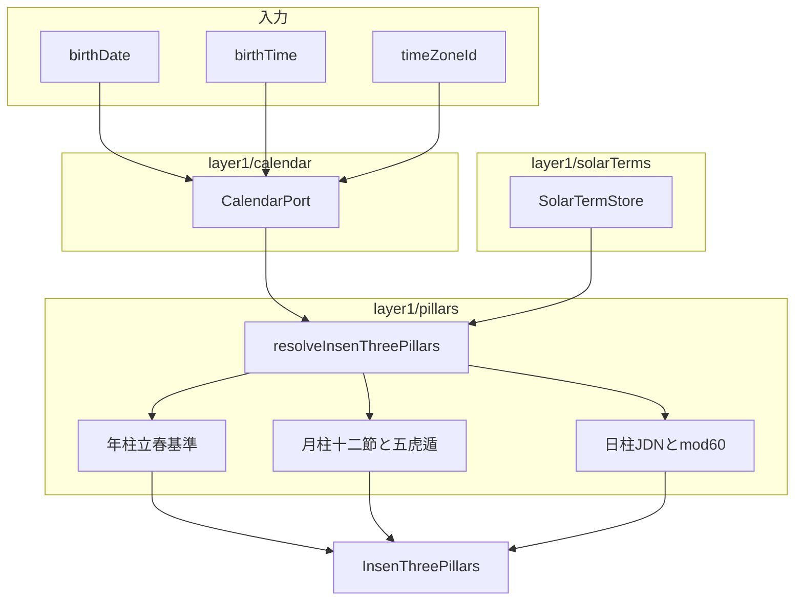
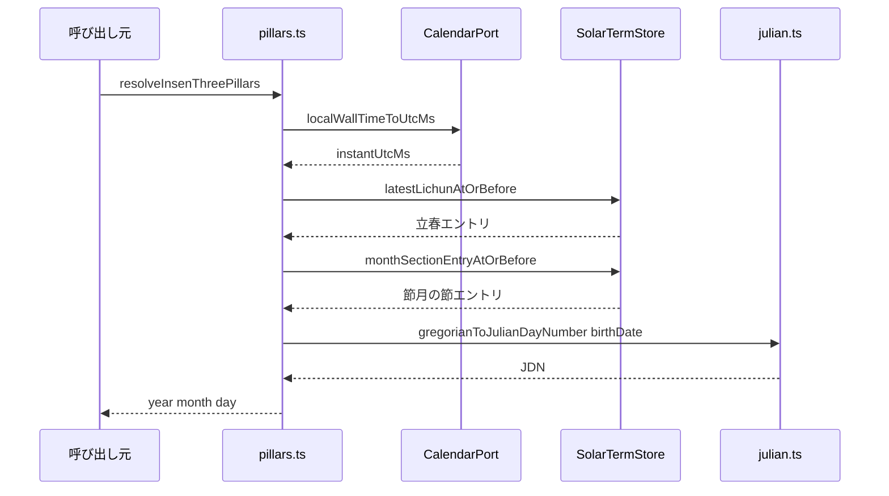
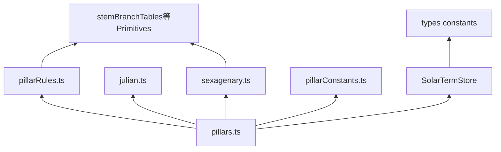
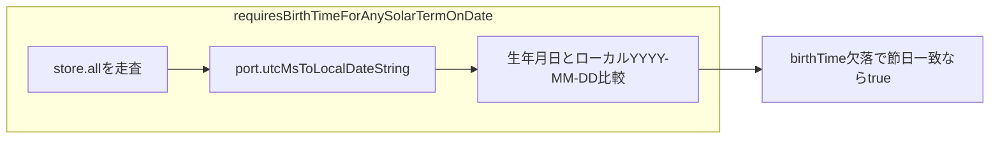

# 実装インデックス（常時更新用）

**リモート Git**: [github.com/DukeGomadango/sanmei-core](https://github.com/DukeGomadango/sanmei-core)（ローカル作業ディレクトリ名と異なってよい）。

本書は **コードベースの現状** を短く追跡するためのドキュメントです。設計の「べき」は [REQUIREMENTS-v1.1.md](./REQUIREMENTS-v1.1.md)・[DOMAIN-GLOSSARY.md](./DOMAIN-GLOSSARY.md) を正とし、実装と乖離したら **本書かコードのどちらかを直し**、可能なら両方を揃えてください。

**メンテ方針**

- PR・リリース前に、変更した節（ディレクトリ・公開 API・データパイプライン）を本書に反映する。
- **層・フェーズ・契約（Proto/Zod 等）や責務境界が変わったら** [ARCHITECTURE-AND-CONTRACTS.md](./ARCHITECTURE-AND-CONTRACTS.md) と、必要なら [DOMAIN-GLOSSARY.md](./DOMAIN-GLOSSARY.md) を更新する。
- **実装で繰り返し使う方針・禁則が変わったら** [.cursor/rules/](../.cursor/rules) を見直す（ルールは長文を持たず正本ドキュメントを指すが、パス・レイヤ説明のズレはここでも解消する）。
- `packages/sanmei-core` の **バージョン**（Layer1 の実体の目安）は [packages/sanmei-core/package.json](../packages/sanmei-core/package.json) の `version` を正とする（本書に毎回書かなくてよい）。
- **レイアウトやサイクルが変わったら**、下記の Mermaid 図も併せて更新する。

---

## システム図（Mermaid）

ビルドや依存の変更後は、図が本文と一致するか確認してください。Cursor / GitHub 等で Mermaid が描画されます。

### リポジトリ全体の配置

開発者・CI・将来の API サーバは **同梱 JSON ＋ `npm` パッケージ** に依存します。天文庫は **ビルド専用**です。



### 節入りマスタのデータフロー



### Layer1：陰占三柱までの計算フロー



### `resolveInsenThreePillars` の呼び出し関係（概略）



### Layer1 内部の依存（主要ファイル）



### 暦境界と `TIME_REQUIRED`（422 相当の判定片）



---

## 1. リポジトリ構成（実装）

| パス | 役割 |
|------|------|
| [packages/sanmei-core/](../packages/sanmei-core/) | **コアパッケージ**（Layer1）。ビルド成果物 `dist/` と同梱データ `data/`。 |
| [tools/solar-term-build/](../tools/solar-term-build/) | 節入り JSON 生成（Python / Skyfield / DE421）。ランタイム非依存。 |
| [README.md](../README.md) | ルートの開発・データ生成コマンド。 |
| [LICENSES.md](../LICENSES.md) | 第三者ライセンス・エフェメリス出所。 |

---

## 2. スコープ（Layer1 の内と外）

**実装済み（Layer1）**

- Primitives: 陰陽・五行・十干・十二支・干合・相生相剋・六十甲子インデックス
- 節入り: 同梱 `solar_terms.json`、メモリ上のソート配列＋二分探索（`SolarTermStore`）
- 暦: `CalendarPort`（初期実装は @js-joda）、民用日時→UTC、ローカル `YYYY-MM-DD` 抽出、節入り日の `TIME_REQUIRED` 判定用ヘルパ
- 陰占三柱（器のみ）: 年柱（立春基準・簡略太陽年ラベル）、月柱（十二「節」＋五虎遁）、日柱（JDN + mod 60）

**未実装（意図的に Layer2 以降）**

- 蔵干・陽占・大運・天中殺スライド・位相法・HTTP `calculate` 全体・Proto 正本 など

---

## 3. モジュールマップ（`sanmei-core/src`）

依存関係の全体像は冒頭の **システム図**（Mermaid）を参照。

| 領域 | 主なファイル | 内容 |
|------|----------------|------|
| 公開 API | [index.ts](../packages/sanmei-core/src/index.ts) | 再エクスポート集約。 |
| Primitives | `layer1/enums.ts`, `stemBranchTables.ts`, `wuxingRelations.ts`, `kango.ts`, `sexagenary.ts` | DOMAIN-GLOSSARY Layer1 に対応。 |
| 定数 | `layer1/pillarConstants.ts` | 年柱アンカー・日柱 JDN 加算（キャリブレーション）。 |
| 柱アルゴリズム | `layer1/pillarRules.ts`, `pillars.ts` | 五虎遁・`resolveInsenThreePillars`。 |
| 節入り | `layer1/solarTerms/*` | `constants`（二十四節 id・月建「節」）, `types`, `store`, `loadJson` |
| 暦 | `layer1/calendar/*` | `julian.ts`, `types`, `jodaAdapter.ts`, `calendarBoundary.ts` |
| 契約（Zod） | `schemas/layer1.ts` | 入力片・三柱形のスキーマ（Layer1 範囲）。 |
| テスト | `*.test.ts` | Vitest。 |

---

## 4. 節入りデータサイクル

1. **生成**: `python tools/solar-term-build/build_solar_terms.py [開始年] [終了年]`
2. **出力**: `packages/sanmei-core/data/solar-terms/solar_terms.json`
3. **メタ**: JSON 内 `meta.ephemerisBundleId`（例: `skyfield-de421-v1`）、`entryCount`、`rangeStartYear` / `rangeEndYear`
4. **ランタイム読込**: `loadBundledSolarTerms()` — パッケージルートからの相対パス（`loadJson.ts` 参照）

**コミット済みマスタの年範囲を変えたら**、本節と必要なら [REQUIREMENTS-v1.1.md](./REQUIREMENTS-v1.1.md) §9 の説明を更新する。

---

## 5. 主要な実装前提（コードと一致させる）

| 項目 | 実装の扱い | 詳細は |
|------|------------|--------|
| 日柱の日界 | 民用暦日 0:00（子初換日なし） | [REQUIREMENTS-v1.1.md](./REQUIREMENTS-v1.1.md) §5 |
| 日柱計算 | `gregorianToJulianDayNumber` + `DAY_PILLAR_JDN_ADDEND`（`pillarConstants.ts`） | キャリブレーション変更時はテスト更新 |
| 太陽年（年柱） | 直近「立春」時刻の **UTC 暦年**でラベル（v1 簡略） | `pillars.ts` の `solarYearLabelUtc` |
| TZ | IANA。初期 `CalendarPort` は js-joda | `jodaAdapter.ts` |
| Layer1 契約 | Zod（Proto は未導入） | `schemas/layer1.ts` |

---

## 6. コマンド

```bash
# ルート
npm install
npm test          # workspace 経由で sanmei-core の Vitest

# パッケージ単体
cd packages/sanmei-core && npm run build && npm run test
```

---

## 7. 更新チェックリスト（コピー用）

- [ ] 新規エントリポイント・ファイルを §3 に追加した
- [ ] **システム図**（Mermaid）を依存・フロー変更に合わせた
- [ ] 節入りの年範囲・生成手順を §4 と突き合わせた
- [ ] 公開するアルゴリズム前提（§5）をコード・要件の両方で矛盾なくした
- [ ] 新しい学び・バグ修正で**契約・境界が変わった**場合は [DOMAIN-GLOSSARY.md](./DOMAIN-GLOSSARY.md) / [OPEN-QUESTIONS.md](./OPEN-QUESTIONS.md) / [REQUIREMENTS-v1.1.md](./REQUIREMENTS-v1.1.md) の該当箇所を更新した
- [ ] **次フェーズ**（Layer2+、Proto、別パッケージ）に進む場合は [ARCHITECTURE-AND-CONTRACTS.md](./ARCHITECTURE-AND-CONTRACTS.md) と `.cursor/rules`（特に `sanmei-architecture.mdc`）を矛盾なくした
- [ ] [Docs/README.md](./README.md) の索引から本書が辿れる

---

## 8. 関連ドキュメント

| 文書 | 役割 |
|------|------|
| [ARCHITECTURE-AND-CONTRACTS.md](./ARCHITECTURE-AND-CONTRACTS.md) | Monorepo・Proto 方針・ゴールデン等 |
| [OPEN-QUESTIONS.md](./OPEN-QUESTIONS.md) | 暦・学派ごとの確定論点 |
| [DOMAIN-GLOSSARY.md](./DOMAIN-GLOSSARY.md) | Layer1/2/3 の概念境界 |
